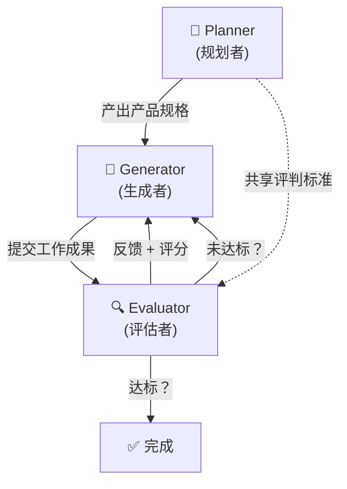

# Harness Engineering 模版

> **Harness Engineering** = 为 AI Agent 构建的脚手架系统——工具、约束、反馈循环和可观测性基础设施，使 Agent 能够可靠、自主地完成复杂的多步骤任务。
>
> 综合 [Anthropic](https://www.anthropic.com/engineering/harness-design-long-running-apps) 与 [OpenAI](https://openai.com/index/harness-engineering/) 的工程实践，本模版提供一套可直接套用到不同项目上的框架。

---

## 一、核心理念

| 原则 | 说明 |
|------|------|
| **工程师 = 环境设计者** | 重点从「写代码」转为「设计让 Agent 能可靠工作的环境」 |
| **Harness > Prompt** | 单靠 Prompt 不够；需要用机械化手段（Linter、测试、结构约束）来执行规范 |
| **最小复杂度** | 先用最简方案，只在需要时增加复杂度；每当底层模型升级时重新审视 Harness 的每一层 |
| **分离生成与评估** | 做事的 Agent 和评审的 Agent 必须分开——自我评估会导致「自我表扬」偏差 |

---

## 二、四大支柱 (OpenAI)

### 2.1 Context Engineering（上下文工程）

> 精心策划 Agent 接收到的信息，使其理解架构意图。

**核心做法：**

- [ ] **`AGENTS.md` 知识库**：在代码仓库根目录维护 `AGENTS.md`，涵盖项目架构、模块边界、命名规范、禁止操作等
- [ ] **动态上下文注入**：根据当前任务阶段，动态向 Agent 注入相关文档、日志、指标
- [ ] **实时可观测性数据**：暴露日志（logs）、指标（metrics）、追踪（traces）给 Agent，使其能做出数据驱动的决策

**模版文件结构：**
```
project-root/
├── AGENTS.md                    # Agent 知识库
├── docs/
│   ├── architecture.md          # 架构概览
│   ├── conventions.md           # 编码规范
│   └── module-boundaries.md     # 模块边界
└── .harness/
    └── context-rules.yaml       # 上下文注入规则
```

**`AGENTS.md` 模版：**
```markdown
# AGENTS.md

## 项目概览
[项目名称] - [一句话描述]

## 架构
- 技术栈: [前端/后端/数据库]
- 模块: [列出核心模块及其职责]

## 约定
- 命名规范: [...]
- 分层规则: [Controller → Service → Repository]
- 禁止操作: [列出不应做的事]

## 关键文件路径
- API 入口: [...]
- 配置文件: [...]
- 测试用例: [...]
```

---

### 2.2 Architectural Constraints（架构约束）

> 用机械化手段强制执行架构规则，而非依赖 Prompt 中的「请你遵守」。

**核心做法：**

- [ ] **自定义 Linter 规则**：编写特定于项目的 Lint 规则来检测架构违规
- [ ] **结构测试（ArchUnit 等）**：用测试代码验证模块依赖方向、分层规则
- [ ] **品味不变量（Taste Invariants）**：把「好代码」的标准编码为可自动检查的规则

**落地清单：**

| 类别 | 工具示例 | 检查内容 |
|------|---------|---------|
| 分层依赖 | ArchUnit / eslint-plugin-import | Controller 不直接调用 Repository |
| 命名规范 | ESLint / Checkstyle | 文件、类、方法命名符合规范 |
| 模块边界 | 自定义 Lint | 模块间不存在循环依赖 |
| 代码风格 | Prettier / Spotless | 格式一致 |
| 安全基线 | SonarQube / Semgrep | 无明显安全漏洞 |

---

### 2.3 Feedback Loops（反馈循环）

> 让 Agent 具备自主迭代能力——暴露测试结果、编译错误、可观测性遥测数据给 Agent。

**核心做法：**

- [ ] **CI/CD 流水线**：Agent 的每次提交自动触发构建 + 测试
- [ ] **自动化测试**：单元测试、集成测试、E2E 测试的结果直接反馈给 Agent
- [ ] **Agent 主导的 Review**：Agent 迭代执行「复现 Bug → 提出修复 → 验证结果」直到通过预定义标准

**反馈循环流程：**
```
Agent 编写代码
    ↓
自动运行 Lint + 测试
    ↓
通过？ → 提交
失败？ → 错误信息 + 失败上下文反馈给 Agent
    ↓
Agent 修复 → 重新运行
    ↓
循环直至通过或达到最大迭代次数
```

---

### 2.4 Entropy Management（熵管理 / 垃圾回收）

> 定期运行后台 Agent 来扫描和修复代码库中的不一致性，防止系统随时间衰退。

**核心做法：**

- [ ] **文档漂移检测**：定期检查代码变更是否已更新对应文档
- [ ] **架构一致性扫描**：自动发现违反架构约束的新代码
- [ ] **死代码清理**：标记和移除不再使用的代码路径
- [ ] **依赖更新**：定期审查和更新过期依赖

---

## 三、多 Agent 架构 (Anthropic)

### 3.1 三角色架构



---

### 3.2 Planner（规划者）

**职责**：接收简短 Prompt（1-4 句），扩展为完整产品规格。

**设计原则：**
- 保持**规格范围雄心勃勃**，但专注于**产品上下文和高层技术设计**
- **不要**指定粒度过细的技术实现细节（避免错误级联到下游）
- 约束产出物（deliverables），让 Generator 自行规划实现路径

**Planner 输出模版：**
```markdown
# [产品名称] - 产品规格

## 概览
[一段话描述产品]

## 功能列表
### 功能 1: [名称]
- 用户故事: As a [角色], I want to [行为], so that [价值]
- 验收标准: [列出可测试的标准]

### 功能 2: [名称]
...

## 技术栈
- 前端: [...]
- 后端: [...]
- 数据库: [...]

## 设计方向
- 整体风格: [...]
- 配色与排版参考: [...]
```

---

### 3.3 Generator（生成者）

**职责**：按功能逐个实现，每个 Sprint 完成一个功能模块。

**工作流程：**
1. 从规格中选取下一个功能
2. 与 Evaluator **协商 Sprint Contract**（约定「完成」的定义和测试标准）
3. 实现功能
4. 自评 + 提交给 Evaluator

**Sprint Contract 模版：**
```markdown
## Sprint N Contract

### 交付内容
- [ ] [具体功能描述]
- [ ] [具体功能描述]

### 完成定义
- [ ] 所有列出的功能可用
- [ ] 无控制台错误
- [ ] 通过以下测试标准:
  1. [可测试的验收条件]
  2. [可测试的验收条件]
  3. ...
```

---

### 3.4 Evaluator（评估者）

**职责**：像真实用户一样操作应用，评估质量，给出具体反馈。

**评估标准模版（可根据项目调整权重）：**

| 维度 | 权重 | 说明 | 阈值 |
|------|------|------|------|
| **产品深度** | ★★★ | 功能是否完整、有深度，还是只有表面实现？ | ≥ 7/10 |
| **功能性** | ★★★ | 用户能否完成核心任务？是否有阻塞性 Bug？ | ≥ 8/10 |
| **设计质量** | ★★ | 配色、排版、布局是否构成一个整体？ | ≥ 6/10 |
| **原创性** | ★★ | 是否有自定义设计决策？还是模版/AI 默认风格？ | ≥ 6/10 |
| **代码质量** | ★ | 代码是否可维护、结构清晰？ | ≥ 7/10 |

**评估流程：**
1. **交互式测试**：使用 Playwright/Selenium 等工具实际点击应用
2. **按标准逐项评分**：每个维度给出分数和详细说明
3. **列出具体 Bug**：描述复现步骤和期望行为
4. **给出改进建议**：具体、可操作的修改方向
5. **做出决定**：通过 / 驳回 + 反馈给 Generator

> [!IMPORTANT]
> **校准评估者**：使用 Few-shot 示例 + 详细评分分解来对齐评估标准。明确指示评估者「严格」而非「宽容」——Agent 默认倾向于肯定自己的输出。

---

## 四、上下文管理策略

### 4.1 Context Reset vs Compaction

| 策略 | 适用场景 | 优势 | 劣势 |
|------|---------|------|------|
| **Context Reset** | 模型出现「上下文焦虑」（提前收尾） | 干净的上下文窗口 | 需要结构化的状态移交 |
| **Compaction** | 模型能处理长上下文 | 持续性好 | 可能残留「焦虑」 |
| **混合** | 按阶段选择 | 灵活 | 编排复杂 |

### 4.2 状态移交（Handoff）模版

```markdown
## Session Handoff

### 已完成
- [x] [已完成的事项]

### 当前状态
- 代码状态: [描述]
- 已知问题: [列出]
- 最后一次测试结果: [通过/失败 + 详情]

### 下一步
- [ ] [接下来要做的事]

### 关键文件
- [文件路径]: [变更摘要]
```

---

## 五、Agent 间通信

Agent 之间通过**文件**进行通信，而非依赖共享内存或 API 调用：

```
.harness/
├── plan.md                 # Planner → Generator
├── sprint-contract-N.md    # Generator ↔ Evaluator 协商
├── evaluation-N.md         # Evaluator → Generator 反馈
├── handoff.md              # Session 间状态移交
└── final-report.md         # 最终评估报告
```

**通信协议：**
1. 写入方在文件中写入内容
2. 读取方阅读文件并在同一文件中追加响应，或创建新文件回复
3. 迭代直至双方达成一致

---

## 六、项目落地清单

### Phase 1: 基础设施搭建
- [ ] 创建 `AGENTS.md` 知识库
- [ ] 编写 `docs/architecture.md`（架构文档）
- [ ] 编写 `docs/conventions.md`（编码规范）
- [ ] 创建 `.harness/` 目录结构

### Phase 2: 架构约束
- [ ] 配置 Linter 规则（ESLint / Checkstyle 等）
- [ ] 编写结构测试（ArchUnit / 依赖检查）
- [ ] 设置代码格式化（Prettier / Spotless）

### Phase 3: 反馈循环
- [ ] 搭建 CI/CD 流水线
- [ ] 编写自动化测试（单元 + 集成 + E2E）
- [ ] 配置测试结果自动反馈到 Agent

### Phase 4: 多 Agent 编排
- [ ] 定义 Planner Prompt + 输出格式
- [ ] 定义 Generator 工作流程 + Sprint 机制
- [ ] 定义 Evaluator 评判标准 + 校准 Few-shot
- [ ] 实现 Agent 间文件通信机制

### Phase 5: 熵管理
- [ ] 设置文档漂移检测
- [ ] 配置定期架构一致性扫描
- [ ] 清理无用代码和依赖

### Phase 6: 迭代优化
- [ ] 阅读 Agent 日志，找到判断偏差
- [ ] 调整 Prompt 和评判标准
- [ ] 在模型升级时重新审视每一层 Harness
- [ ] 移除不再需要的 Harness 组件

---

## 七、关键经验

> [!TIP]
> **Anthropic："Harness 的有趣组合空间不会随模型进步而缩小——它会移动。"**
> 
> 每当新模型发布，重新审视 Harness：移除不再必要的部分，增加新的能力层。

> [!TIP]
> **OpenAI："工程师的角色从『写代码』变为『设计控制系统』。"**
> 
> 投入精力在环境设计（Linter、测试、文档、约束）上，而非逐行编写实现。

| 来源 | 经验 |
|------|------|
| Anthropic | 分离生成与评估，解决 Agent 的「自我表扬」问题 |
| Anthropic | 评判标准的措辞会直接影响生成方向（如「博物馆级美学」→ 3D 沉浸体验） |
| Anthropic | Sprint Contract 机制弥合高层规格与可测试实现之间的鸿沟 |
| Anthropic | 评估者校准需要多轮迭代——阅读日志、找出判断偏差、更新 Prompt |
| OpenAI | 约 1/10 的传统开发时间完成百万行代码项目 |
| OpenAI | `AGENTS.md` 作为代码仓库内的 Agent 知识库是关键上下文来源 |
| OpenAI | 用 Linter 和结构测试强制执行约束比 Prompt 指示可靠得多 |
| OpenAI | 熵管理对长期项目至关重要——代码库会自然衰退 |

---

## 八、Reference

1. [Anthropic: Harness design for long-running application development](https://www.anthropic.com/engineering/harness-design-long-running-apps) (Mar 2026)
2. [OpenAI: Harness engineering — leveraging Codex in an agent-first world](https://openai.com/index/harness-engineering/) (Feb 2026)
3. [Anthropic: Building Effective Agents](https://www.anthropic.com/research/building-effective-agents)
4. [Anthropic: Effective harnesses for long-running agents](https://www.anthropic.com/engineering/effective-harnesses-for-long-running-agents)
5. [Anthropic: Context Engineering for AI Agents](https://www.anthropic.com/engineering/effective-context-engineering-for-ai-agents)
