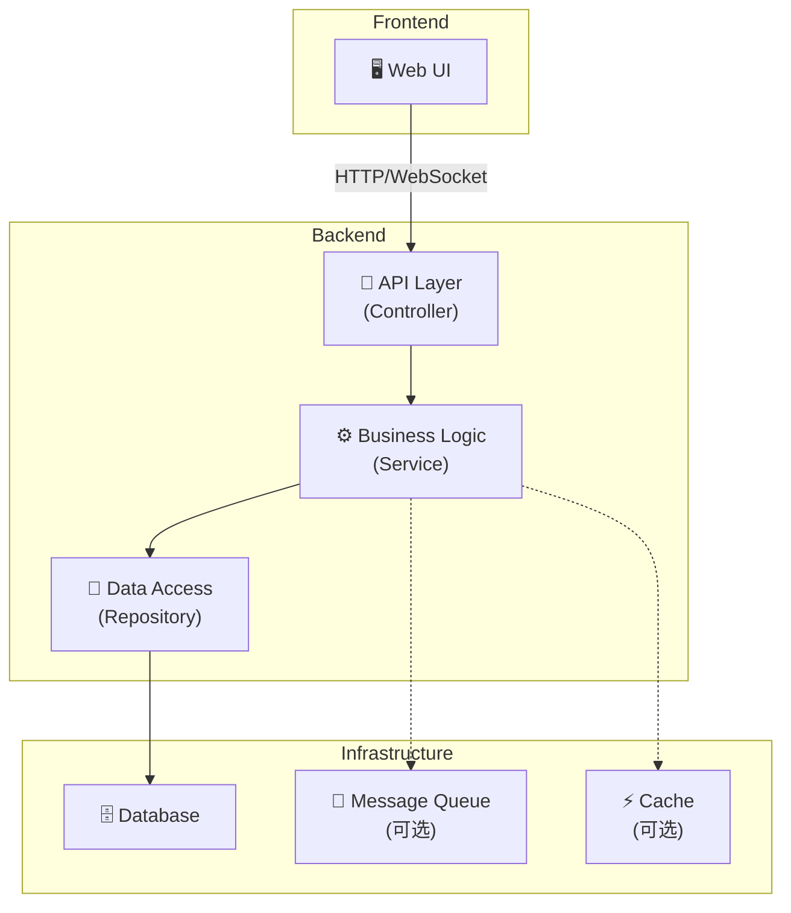
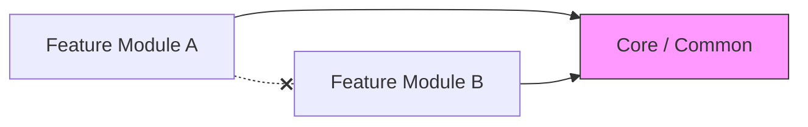
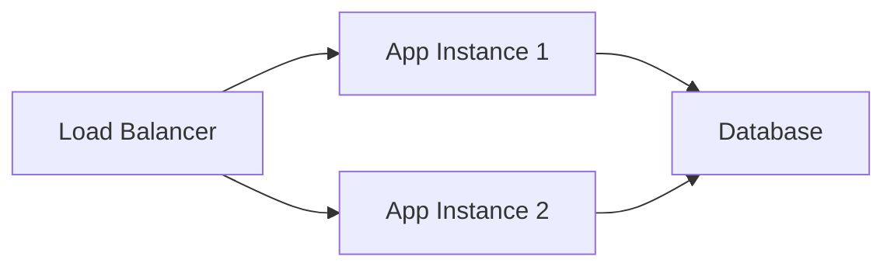

# 架构文档

> 本文档描述项目的整体架构设计。Agent 和开发者应以此为系统设计的权威参考。

## 系统架构图



## 模块划分

<!-- TODO: 根据你的项目填写 -->

### 核心模块

| 模块 | 职责 | 依赖 |
|------|------|------|
| `auth` | 认证与授权 | database |
| `user` | 用户管理 | auth, database |
| <!-- 模块名 --> | <!-- 职责 --> | <!-- 依赖 --> |

### 模块依赖规则



- ✅ Feature 模块可以依赖 Core/Common
- ✅ Feature 模块可以依赖 Infrastructure 层
- ❌ Feature 模块之间**不应**互相依赖
- ❌ Core/Common **不应**依赖 Feature 模块

## API 设计规范

### RESTful 路由
```
GET    /api/v1/{resource}          # 列表查询
GET    /api/v1/{resource}/{id}     # 单条查询
POST   /api/v1/{resource}          # 创建
PUT    /api/v1/{resource}/{id}     # 全量更新
PATCH  /api/v1/{resource}/{id}     # 部分更新
DELETE /api/v1/{resource}/{id}     # 删除
```

### 响应格式
```json
{
  "code": 0,
  "message": "success",
  "data": { }
}
```

### 错误响应格式
```json
{
  "code": 40001,
  "message": "Validation failed",
  "errors": [
    { "field": "email", "message": "Invalid email format" }
  ]
}
```

## 数据库设计原则

- 每张表必须有主键 (`id`)
- 使用 `created_at` 和 `updated_at` 时间戳
- 软删除使用 `deleted_at` 字段（可选）
- 外键关系在应用层维护（微服务场景）或数据库层维护（单体场景）
- 索引策略：为高频查询字段创建索引

## 安全要求

- [ ] 所有 API 端点需认证（除公开端点外）
- [ ] 敏感数据加密存储
- [ ] SQL 注入防护（使用参数化查询）
- [ ] XSS 防护（输入消毒 + CSP 头）
- [ ] CORS 配置白名单
- [ ] Rate Limiting

## 部署架构

<!-- TODO: 根据实际情况调整 -->


## 性能目标

| 指标 | 目标 |
|------|------|
| API 响应时间 (P95) | < 200ms |
| 页面首次加载 | < 2s |
| 数据库查询 | < 50ms |
| 系统可用性 | 99.9% |
