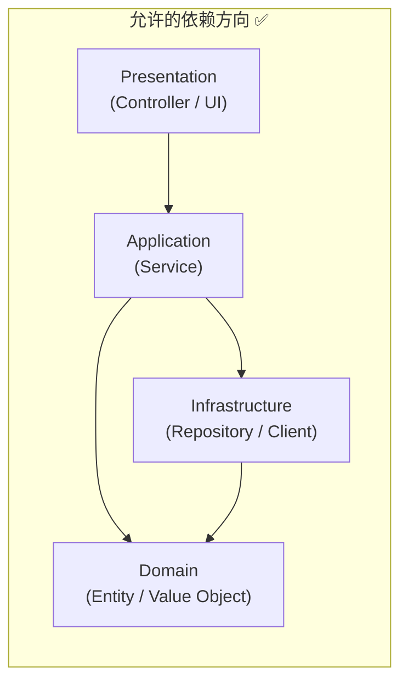
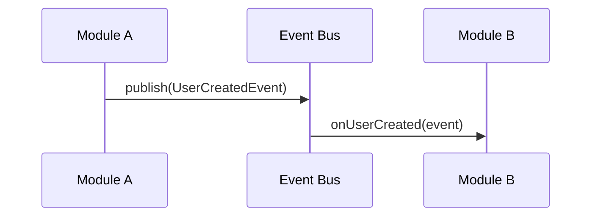

# 模块边界

> 本文档定义模块间的依赖规则和边界。违反这些规则应被 Linter 或结构测试自动拦截。

## 依赖方向



## 禁止的依赖 ❌

| From | To | 原因 |
|------|----|------|
| Domain | Infrastructure | Domain 应是纯净的，不依赖外部 |
| Domain | Application | 内层不应依赖外层 |
| Infrastructure | Application | Repository 不应调用 Service |
| 任何模块 | Presentation | 底层不应依赖展示层 |
| Feature A | Feature B | Feature 间必须通过 Service 层或事件通信 |

## 模块接口契约

每个模块只通过**公共接口**暴露功能，内部实现对外不可见。

```
module-a/
├── api/                  # 公共接口（其他模块可依赖）
│   ├── ModuleAService.java       # 接口定义
│   └── dto/
│       ├── ModuleARequest.java
│       └── ModuleAResponse.java
├── internal/             # 内部实现（其他模块不可访问）
│   ├── ModuleAServiceImpl.java
│   ├── ModuleARepository.java
│   └── ModuleAEntity.java
└── config/               # 模块配置
    └── ModuleAConfig.java
```

## 跨模块通信

### 同步通信
- 通过接口调用（依赖注入）
- 调用方依赖接口，而非实现

### 异步通信
- 通过事件/消息（Event / Message Queue）
- 发布方定义事件，订阅方监听
- 事件对象放在 `common/events/` 中



## 结构测试示例

### ArchUnit (Java)
```java
@ArchTest
static final ArchRule services_should_not_depend_on_controllers =
    noClasses()
        .that().resideInAPackage("..service..")
        .should().dependOnClassesThat()
        .resideInAPackage("..controller..");

@ArchTest
static final ArchRule repositories_should_not_depend_on_services =
    noClasses()
        .that().resideInAPackage("..repository..")
        .should().dependOnClassesThat()
        .resideInAPackage("..service..");

@ArchTest
static final ArchRule no_cycles_between_modules =
    slices()
        .matching("com.example.(*)..")
        .should().beFreeOfCycles();
```

### ESLint (TypeScript / JavaScript)
```json
{
  "rules": {
    "import/no-restricted-paths": ["error", {
      "zones": [
        {
          "target": "./src/domain",
          "from": "./src/infrastructure",
          "message": "Domain 层不能依赖 Infrastructure 层"
        },
        {
          "target": "./src/domain",
          "from": "./src/application",
          "message": "Domain 层不能依赖 Application 层"
        }
      ]
    }]
  }
}
```

## 新增模块检查清单

在新增模块时，确认以下事项：

- [ ] 模块有明确的单一职责
- [ ] 公共 API 通过接口定义
- [ ] 内部实现不被外部访问
- [ ] 依赖方向符合规则
- [ ] 已添加对应的结构测试
- [ ] 已更新本文档的模块列表
